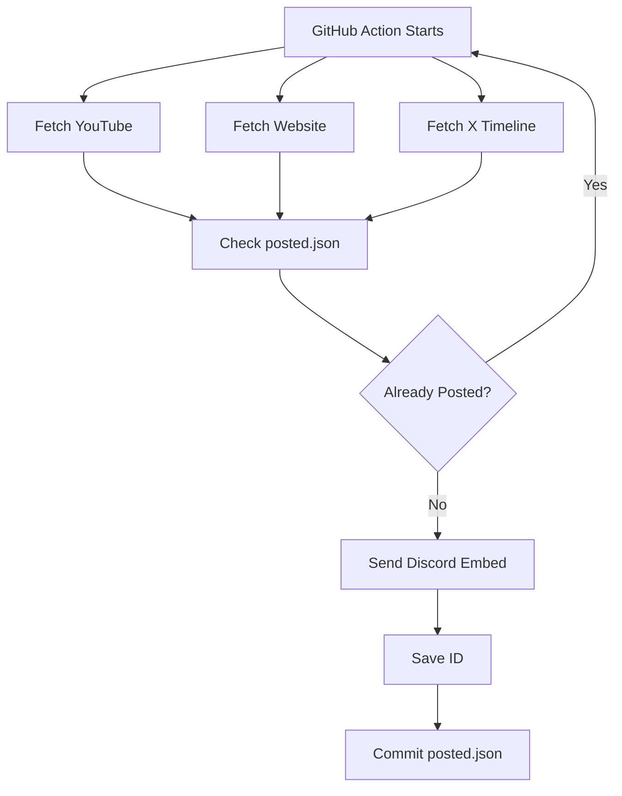

<div align="center">

# 🌊 Wuthering Waves News Bot

### *One Bot • Three Official Sources • Zero Duplicates*


---

> **Automatically monitors official Wuthering Waves news and instantly delivers updates to Discord.**

</div>

---

# ✨ Features

<table>
<tr>
<td width="50%">

### 📺 YouTube
- Official channel monitoring
- RSS Feed
- Video thumbnails
- Instant notifications

</td>
<td width="50%">

### 🌐 Official Website
- News articles
- Character reveals
- Event announcements
- Auto thumbnails

</td>
</tr>

<tr>
<td>

### 🐦 X (Twitter)
- No Paid API
- Guest Authentication
- GraphQL Timeline
- Image Support

</td>
<td>

### 🤖 Discord
- Rich Embeds
- Auto Images
- Timestamps
- Duplicate Prevention

</td>
</tr>
</table>

---

# 🚀 Architecture

```text
                  ┌────────────────────────────┐
                  │   GitHub Actions (Cron)    │
                  └─────────────┬──────────────┘
                                │
               ┌────────────────┼────────────────┐
               │                │                │
               ▼                ▼                ▼
         YouTube RSS      Official Site      X GraphQL
               │                │                │
               └────────────────┼────────────────┘
                                ▼
                     Parse Latest Content
                                ▼
                     Duplicate Detection
                      (posted.json)
                                ▼
                    Discord Webhook Embed
                                ▼
                         Discord Server
```

---

# 📂 Project Structure

```text
WuWa-News-Bot
│
├── sources/
│   ├── youtube.py
│   ├── website.py
│   ├── x.py
│   ├── x_client.py
│   └── x_constants.py
│
├── utils/
│   ├── discord.py
│   └── storage.py
│
├── posted.json
├── main.py
├── requirements.txt
└── .github/
    └── workflows/
        └── bot.yml
```

---

# ⚡ Workflow



---

# 🔥 Technologies

| Technology | Purpose |
|------------|---------|
| 🐍 Python | Core Application |
| 🌐 Requests | HTTP Client |
| 📺 RSS | YouTube Feed |
| 🐦 X GraphQL | Twitter Timeline |
| 🎮 Discord Webhooks | Notifications |
| ⚙ GitHub Actions | Scheduler |
| 📦 JSON Storage | Duplicate Detection |

---

# 🧠 Smart Duplicate Detection

The bot stores every posted item's ID inside

```text
posted.json
```

Each run:

```
Latest News
      │
      ▼
Is ID already stored?
      │
 ┌────┴────┐
 │         │
Yes        No
 │         │
Skip    Send to Discord
           │
           ▼
     Save New ID
```

No duplicate notifications.

Ever.

---

# ⚙ Setup

## Clone

```bash
git clone https://github.com/yourusername/wuwa-news-bot.git

cd wuwa-news-bot
```

---

## Install

```bash
pip install -r requirements.txt
```

---

## GitHub Secret

Create:

```
DISCORD_WEBHOOK
```

with your Discord Webhook URL.

---

## Run

```bash
python main.py
```

---

# 📸 Sample Output

```
📺 New YouTube Video

🌐 New Website Article

🐦 New X Post
```

Rich embeds are automatically sent to Discord.

---

# 🌟 Highlights

✅ Zero Paid APIs

✅ Zero Selenium

✅ Zero Playwright

✅ Zero Cookies

✅ Persistent Storage

✅ GitHub Actions Ready

✅ Rich Discord Embeds

---

# 📈 Future Improvements

- [ ] Multi-language Support
- [ ] Slash Commands
- [ ] Multiple Discord Servers
- [ ] SQLite Support
- [ ] RSS Auto Discovery
- [ ] Docker Support
- [ ] Web Dashboard

---

<div align="center">

## ⭐ If you like this project...

Give it a ⭐ on GitHub!

Made with ❤️ for the **Wuthering Waves** community.

</div>
